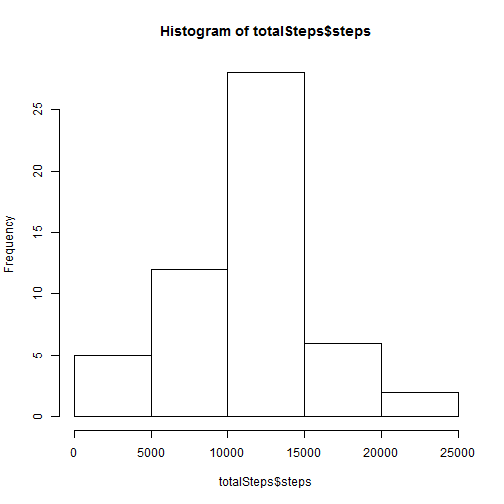
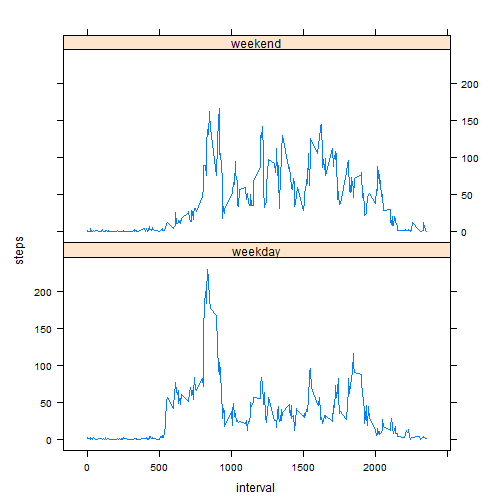

Reproducible Research Assignment1
========================================================

This is an R Markdown document. Markdown is a simple formatting syntax for authoring web pages (click the **Help** toolbar button for more details on using R Markdown).

When you click the **Knit HTML** button a web page will be generated that includes both content as well as the output of any embedded R code chunks within the document. You can embed an R code chunk like this:
RepData peer Assesssment 1
========================================================


Loading The Data From Current Dirtory
------------------------------------
------------------------------------

* Load The CSV

```r
#activity=read.csv("C:\\Users\\Razib\\Desktop\\Reproducible Research\\repdata-data-activity\\activity.csv")
activity=read.csv("activity.csv")
```
* Process The CSV File For Format Suitable.

```r
totalSteps<-aggregate(steps~date,data=activity,sum,na.rm=TRUE)
```

What is mean total number of steps taken per day?
-------------------------------------------------

* Make a histogram for total number of steps taken each day.

```r
hist(totalSteps$steps)
```

 

* Calculate and report the mean and median total number of steps taken per day
per day 


```r
mean(totalSteps$steps)
```

```
## [1] 10766
```

```r
median(totalSteps$steps)
```

```
## [1] 10765
```
* The mean total number of steps taken per day is 
    1.0766 &times; 10<sup>4</sup> steps.
* The median total number of steps taken per day is 
    10765 steps.
    
What is the average daily activity pattern?
-------------------------------------------

* Make a time series plot of the 5-minute interval (x-axis) and the average number of steps taken, averaged across all days (y-axis)


```r
stepsInterval<-aggregate(steps~interval,data=activity,mean,na.rm=TRUE)
plot(steps~interval,data=stepsInterval,type="l")
```

 

* Which 5-minute interval, on average across all the days in the dataset, contains the maximum number of steps? 

```r
stepsInterval[which.max(stepsInterval$steps),]$interval
```

```
## [1] 835
```

It is the **835th** interval.

Imputing missing values
-----------------------
-----------------------

* Calculate and report the total number of missing values in the dataset (i.e. the total number of rows with NAs)

```r
sum(is.na(activity$steps))
```

```
## [1] 2304
```
Total 2304 rows are missing.

I made a function **"interval2steps"** to get the mean steps for particular 5-minute interval. 

```r
interval2steps<-function(interval){
    stepsInterval[stepsInterval$interval==interval,]$steps
}
```

* Create a new dataset that is equal to the original dataset but with the missing data filled in.


```r
activityFilled<-activity   
count=0          
for(i in 1:nrow(activityFilled)){
    if(is.na(activityFilled[i,]$steps)){
        activityFilled[i,]$steps<-interval2steps(activityFilled[i,]$interval)
        count=count+1
    }
}
cat("Total ",count, "NA values were filled.\n\r")  
```

```
## Total  2304 NA values were filled.
## 
```

* Make a histogram of the total number of steps taken each day and Calculate and report the mean and median total number of steps taken per day. 

```r
totalSteps2<-aggregate(steps~date,data=activityFilled,sum)
hist(totalSteps2$steps)
```

 

```r
mean(totalSteps2$steps)
```

```
## [1] 10766
```

```r
median(totalSteps2$steps)
```

```
## [1] 10766
```
* The mean total number of steps taken per day is 
1.0766 &times; 10<sup>4</sup> steps.
* The median total number of steps taken per day is 
1.0766 &times; 10<sup>4</sup> steps.

Are there differences in activity patterns between weekdays and weekends?
---------------------------------------------------------------------------
----------------------------------------------------------------------------


```r
activityFilled$day=ifelse(as.POSIXlt(as.Date(activityFilled$date))$wday%%6==0,
                          "weekend","weekday")
activityFilled$day=factor(activityFilled$day,levels=c("weekday","weekend"))
```


```r
stepsInterval2=aggregate(steps~interval+day,activityFilled,mean)
library(lattice)
xyplot(steps~interval|factor(day),data=stepsInterval2,aspect=1/2,type="l")
```

 
